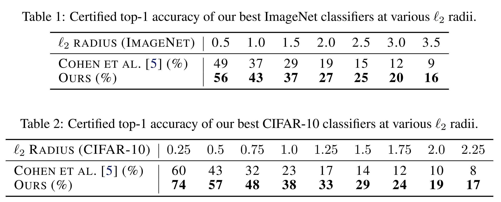
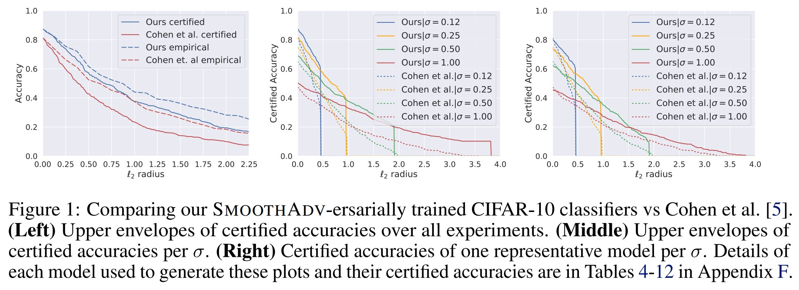
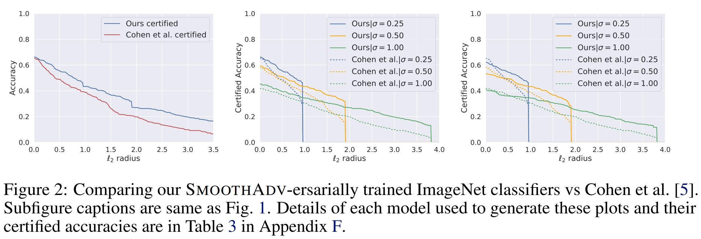

# Provably Robust Deep Learning via Adversarially Trained Smoothed Classifiers

This repository contains the code and models necessary to replicate the results of our recent paper:

**Provably Robust Deep Learning via Adversarially Trained Smoothed Classifiers** <br>
*Hadi Salman, Greg Yang, Jerry Li, Huan Zhang, Pengchuan Zhang, Ilya Razenshteyn, Sebastien Bubeck* <br>
Paper: https://arxiv.org/abs/1906.04584 <br>
Blog post: https://decentdescent.org/smoothadv.html

Our paper outperforms all existing provably L2-robust classifiers by a significant margin on ImageNet and CIFAR-10, *establishing the state-of-the-art for provable L2-defenses.*


<p>

</p>

## Overview of the Repository

Our code is based on the open source code of [Cohen et al (2019)](https://github.com/locuslab/smoothing). The major content of our repo are:

* [code/](code) contains the code for our experiments.
* [data/](data) contains the log data from our experiments.
* [analysis/](analysis) contains the plots and tables, based on the contents of [data/](data), that are shown in our paper.

Let us dive into the files in [code/](code):

1. `train_pgd.py`: the main code to adversarially train smoothed classifiers.
2. `train.py`: the original training code of [Cohen et al (2019)](https://github.com/locuslab/smoothing) using Gaussian noise data augmentation.
3. `certify.py`: Given a pretrained smoothed classifier, returns a certified L2-radius for each data point in a given dataset using the algorithm of [Cohen et al (2019)](https://github.com/locuslab/smoothing).
4. `predict.py`: Given a pretrained smoothed classifier, predicts the class of each data point in a given dataset.
5. `architectures.py`: an entry point for specifying which model architecture to use per dataset (Resnet-50 for ImageNet, Resnet-110 for CIFAR-10).
6. `attacks.py`: contains our PGD and DDN attacks for smoothed classifiers (referred to as SmoothAdv<sub>PGD</sub> and SmoothAdv<sub>DDN</sub> in the paper).

## Getting started

1.  `git clone https://github.com/Hadisalman/smoothing-adversarial.git`

2.  Install dependencies:
```
conda create -n smoothing-adversarial python=3.6
conda activate smoothing-adversarial
conda install numpy matplotlib pandas seaborn
pip install setGPU
conda install pytorch torchvision cudatoolkit=10.0 -c pytorch # for Linux
```

3. Download our trained models from [here](https://drive.google.com/open?id=1GH7OeKUzOGiouKhendC-501pLYNRvU8c). Then move the downloaded `models.tar.gz` into the root directory of this repo. Run `tar -xzvf models.tar.gz` to extract the models.

4. If you want to run ImageNet experiments, obtain a copy of ImageNet and preprocess the val directory to look like the train directory by running [this script](https://raw.githubusercontent.com/soumith/imagenetloader.torch/master/valprep.sh). Finally, set the environment variable IMAGENET_DIR to the directory where ImageNet is located.

5. Let us try to certify the robustness of one of our adversarially trained CIFAR-10 models.
```
model="pretrained_models/cifar10/finetune_cifar_from_imagenetPGD2steps/PGD_10steps_30epochs_multinoise/2-multitrain/eps_64/cifar10/resnet110/noise_0.12/checkpoint.pth.tar"
output="certification_output"
python code/certify.py cifar10 $model 0.12 $output --skip 20 --batch 400
```
Check the results in `certification_output`. You should get similar to [these results](data/certify/cifar10/finetune_cifar_from_imagenetPGD2steps/PGD_10steps_30epochs_multinoise/2-multitrain/eps_64/cifar10/resnet110/noise_0.12/test/sigma_0.12).


## Example
Let us train a smoothed resnet110 CIFAR-10 classifier using *SmoothAdv-ersarial training* (see our paper), certify its robustness, and attack it.

#### Adversarial training
* Train the model via 10 step (smooth) PGD adversarial training with &epsilon;=64/255, &sigma;=0.12, and m_train=2
```
python code/train_pgd.py cifar10 cifar_resnet110 model_output_dir --batch 256 --noise 0.12 --gpu 0 --lr_step_size 50 --epochs 150 --adv-training --attack PGD --num-steps 10 --epsilon 64 --train-multi-noise --num-noise-vec 2 --warmup 10
```

**For a faster result, start from an ImageNet pretrained model and fine-tune for only 30 epochs! We are open-sourceing 16 ImageNet pretrained models (see the imagenet32 folder [here](https://drive.google.com/open?id=1GH7OeKUzOGiouKhendC-501pLYNRvU8c)) that are trained using our code. Use the one with the desired &epsilon; and &sigma; as shown below**

```
python code/train_pgd.py cifar10 cifar_resnet110 model_output_dir --batch 256 --noise 0.12 --gpu 0 --lr 0.001 --epochs 30 --adv-training --attack PGD --num-steps 10 --epsilon 64 --train-multi-noise --num-noise-vec 2 --resume --pretrained-model pretrained_models/imagenet32/PGD_2steps/eps_64/imagenet32/resnet110/noise_0.12/checkpoint.pth.tar
```

If you still cannot wait for training to finish, dont worry! We have this model pretrained for you. Simply set
```
model_output_dir=pretrained_models/cifar10/finetune_cifar_from_imagenetPGD2steps/PGD_10steps_30epochs_multinoise/2-multitrain/eps_64/cifar10/resnet110/noise_0.12
```
and contiue with the example!
#### Certification
* Certify the trained model on CIFAR-10 test set using &sigma;=0.12
```
python code/certify.py cifar10 $model_output_dir/checkpoint.pth.tar 0.12 certification_output --batch 400 --alpha 0.001 --N0 100 --N 100000
```
will load the base classifier saved at `$model_output_dir/checkpoint.pth.tar`, smooth it using noise level &sigma;=0.12, and certify every image from the cifar10 test set with parameters `N0=100`, `N=100000` and `alpha=0.001`.


#### Visualize robustness plots
Repeating the above two steps (Training and Certification) for &sigma;=0.12, 0.25, 0.5, and 1.0 allows you to generate the below plot. Simply run:
```
python code/generate_github_result.py
```
This generate the below plot using [our certification results](data/certify/cifar10/finetune_cifar_from_imagenetPGD2steps/PGD_10steps_30epochs_multinoise/2-multitrain/eps_64/cifar10/resnet110/). Modify the paths inside `generate_github_result.py` to point to your `certification_output` in order to plot your results.

<p>

</p>


#### Prediction
* Predict the classes of CIFAR-10 test set using &sigma;=0.12
```
python code/predict.py cifar10 $model_output_dir/checkpoint.pth.tar 0.12 prediction_output_dir --batch 400 --N 1000 alpha=0.001
```
will load the base classifier saved at `$model_output_dir/checkpoint.pth.tar`, smooth it using noise level &sigma;=0.12, and classify every image from the cifar10 test set with parameters `N=1000` and `alpha=0.001`.

#### Empirical attack
* Attacking the trained model using SmoothAdv<sub>PGD</sub> with &epsilon;=64/255 or 127/255 or 255/255, T=20 steps,  m_test=32, and &sigma;=0.12. Then predicts the classes of the resulting adversarial examples. The flag `--visualize-examples` saves the first 1000 adversarial examples in the `prediction_output_dir`. 
```
python code/predict.py cifar10 $model_output_dir/checkpoint.pth.tar 0.12 prediction_output_dir --batch 400 --N 1000 --attack PGD --epsilon 64 --num-steps 20 --num-noise-vec 32 --visualize-examples 

python code/predict.py cifar10 $model_output_dir/checkpoint.pth.tar 0.12 prediction_output_dir --batch 400 --N 1000 --attack PGD --epsilon 127 --num-steps 20 --num-noise-vec 32 --visualize-examples 

python code/predict.py cifar10 $model_output_dir/checkpoint.pth.tar 0.12 prediction_output_dir --batch 400 --N 1000 --attack PGD --epsilon 255 --num-steps 20 --num-noise-vec 32 --visualize-examples 
```

## Replicate our tables and figures
We provide code to generate all the tables and results of our paper. Simply run 

```
python code/analyze.py
```
This code reads from [data/](data) i.e. the logs that were generated when we certifiied our trained models, and automatically generates the tables and figures that we present in the paper.

Below are example plots from our paper which you will be able to replicate by running the above code.

<p>

</p>
<p>

</p>


## Download our pretrained models
**You can download our trained models [here](https://drive.google.com/open?id=1GH7OeKUzOGiouKhendC-501pLYNRvU8c)**. These contain all our provably robust models (that achieve SOTA for provably L2-robust image classification on CIFAR-10 and ImageNet) that we present in our paper.

The downloaded folder contains two subfolders: `imagenet` and `cifar10`. Each of these contains subfolders with different hyperparameters for training imagenet and cifar10 classifiers respectively. 

For example:
- `pretrained_models/cifar10/` contains `PGD_2steps/`, `PGD_4steps/`, `DDN_2steps/`  ..... corresponding to different attacks.
  - `PGD_2steps/` contatins:
     - `eps_64/`, `eps_127/`, `eps_255/`, `eps_512/`, correpsonding to models trained with various &epsilon; (maximum allowed L2-perturbation).
     - `jobs.yaml` file that has the exact commands we used to train the models in `PGD_2steps/` e.g.

```
#"jobs.yaml"
jobs:
- name: eps_64/cifar10/resnet110/noise_0.12
  sku: G1
  sku_count: 1
  command:
  - python code/train_pgd.py cifar10 cifar_resnet110 ./ --batch 256 --noise 0.12 --gpu
    0 --lr_step_size 50 --epochs 150 --adv-training --attack PGD --epsilon 64 --num-steps
    2 --resume --warmup 10
  id: application_1556605998994_2048
  results_dir: /mnt/_output/pt-results/2019-05-02/application_1556605998994_2048
  submit_args: {}
  tags: []
  type: bash
  .
  .
  .
```
You should focus on the `- name:`  and `command:` lines of every `jobs.yaml` as they reflect our experiments and their correpsonding commands. (*Ignore the rest of the details which are specific to our job scheduling system*).

## Acknowledgement
We would like to thank Zico Kolter, Jeremy Cohen, Elan Rosenfeld, Aleksander Madry, Andrew Ilyas, Dimitris Tsipras, Shibani Santurkar, Jacob Steinhardt for comments and discussions.


## Contact
If you have any question, or if anything of the above is not working, don't hestitate to contact us! We are more than happy to help!

* Hadi Salman (hadi dot salman at microsoft dot com)
* Greg Yang (gregyang at microsoft dot com)
* Jerry Li (jerrl at microsoft dot com)
* Ilya Razenshteyn (ilyaraz at microsoft dot com)

